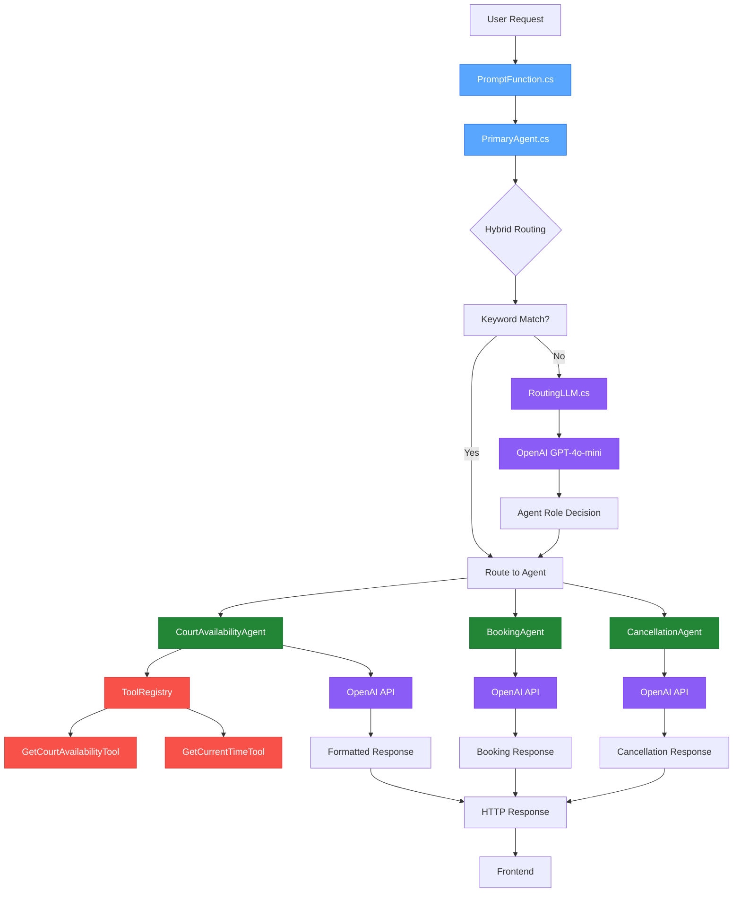

# Multi-Agent Architecture for Court Booking Function App

This document describes the multi-agent architecture implemented for the Azure Functions court booking system.

## Architecture Overview

The system has been refactored from a monolithic function into a structured multi-agent architecture that routes user prompts to domain-specific sub-agents.



## File Structure

### New Files Created

1. **`Agents/IAgent.cs`** - Interface for all agents
2. **`Agents/RoutingLLM.cs`** - OpenAI-based routing service  
3. **`Agents/PrimaryAgent.cs`** - Main orchestrator with hybrid routing
4. **`Agents/CourtAvailabilityAgent.cs`** - Fully functional court availability agent
5. **`Agents/BookingAgent.cs`** - Placeholder for future booking functionality
6. **`Agents/CancellationAgent.cs`** - Placeholder for cancellation functionality

### Updated Files

- **`PromptFunction.cs`** - Simplified to use PrimaryAgent

## Key Features

### Hybrid Routing System

The system uses a two-tiered routing approach:

1. **Keyword-based routing first** - Fast pattern matching for common queries
2. **LLM fallback routing** - Uses OpenAI when keywords don't match clearly
3. **Smart defaults** - Falls back to court availability agent if routing fails

### Routing Logic Examples

```csharp
// Keyword examples that route directly:
"book a court at 6pm" → BookingAgent
"cancel my booking" → CancellationAgent  
"what courts are available today?" → CourtAvailabilityAgent
"who's playing after 5pm?" → CourtAvailabilityAgent

// Complex queries route via LLM:
"I need to reschedule my game" → RoutingLLM → CancellationAgent
```

### Preserved Functionality

- **All existing tools work** - CourtAvailabilityAgent uses existing ToolRegistry
- **Same response format** - Court availability responses maintain preferred formatting
- **Error handling** - Comprehensive error handling at each level
- **CORS support** - All existing CORS headers preserved

## Benefits

### Scalability
- **Easy to add new agents** - Just implement IAgent interface
- **Domain separation** - Each agent handles specific functionality
- **Tool isolation** - Agents only register tools they need

### Maintainability
- **Clean separation of concerns** - Routing, domain logic, and tools are separate
- **Testable components** - Each agent can be tested independently
- **Future-proof** - Easy to add stats, reports, or other functionality

### Performance
- **Fast keyword routing** - Most common queries bypass LLM routing
- **Selective tool loading** - Agents only load relevant tools
- **Efficient OpenAI usage** - Only one routing call when needed

## How It Works

1. **User sends prompt** → `PromptFunction.cs`
2. **Routes to** → `PrimaryAgent.HandleAsync()`
3. **Tries keyword matching first** → Fast routing for common patterns
4. **Falls back to LLM** → `RoutingLLM.GetAgentRoleAsync()` for complex queries
5. **Calls appropriate agent** → Domain-specific processing
6. **Returns formatted response** → Back to user

## Agent Implementations

### CourtAvailabilityAgent
- **Fully functional** - Uses existing GetCourtAvailabilityTool and GetCurrentTimeTool
- **Specialized system prompt** - Optimized for court availability queries
- **Formatted responses** - Maintains the structured court availability format

### BookingAgent & CancellationAgent
- **Placeholder implementations** - Ready for future booking functionality
- **Graceful degradation** - Explains current limitations and suggests alternatives
- **Extensible design** - Easy to add actual booking/cancellation tools later

## Adding New Agents

To add a new agent:

1. **Create agent class** implementing `IAgent`
2. **Register in PrimaryAgent** constructor
3. **Add routing keywords** in `GetAgentRoleByKeywords()` method
4. **Update RoutingLLM system prompt** to include new agent role

Example:
```csharp
public class StatsAgent : IAgent
{
    public string Name => "stats";
    public string Description => "Handles statistics and reporting queries";
    
    public async Task<string> HandleAsync(string prompt, string? userId = null, string? sessionId = null)
    {
        // Implementation here
    }
}
```

## Environment Requirements

- **OpenAI_API_Key** environment variable must be set
- **.NET 6.0** runtime
- **Azure Functions Core Tools** for local development

## Testing

The modular architecture allows for easy unit testing:

- **Test agents independently** - Mock the OpenAI client
- **Test routing logic** - Verify keyword and LLM-based routing
- **Integration tests** - Test the full flow through PrimaryAgent